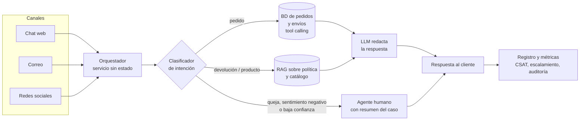

# EcoMarket: IA generativa para la atención al cliente

**Taller Práctico #1 — IA Generativa**
Maestría en Inteligencia Artificial Aplicada
**Autor:**Pedro Albeiro Jojoa Hernández

## El caso en tres líneas

EcoMarket, un e-commerce de productos sostenibles, recibe miles de consultas diarias por chat, correo y redes sociales. El 80 % son repetitivas (estado del pedido, devoluciones, productos) y hoy tardan 24 horas en responderse. Este repositorio diseña una solución de IA generativa que responde ese 80 % en segundos y escala a humanos el 20 % que necesita empatía.

## Índice de las fases

| Fase | Documento | Contenido |
|---|---|---|
| 1. Selección y justificación del modelo | [docs/fase1_seleccion_modelo.md](docs/fase1_seleccion_modelo.md) | Alternativas comparadas, arquitectura híbrida, estimación de costos, escalabilidad e integración |
| 2. Fortalezas, limitaciones y riesgos éticos | [docs/fase2_evaluacion_riesgos.md](docs/fase2_evaluacion_riesgos.md) | Riesgos con ejemplo, mitigación y métrica; Ley 1581 de 2012; KPI y gobernanza |
| 3. Ingeniería de prompts | [docs/fase3_bitacora_prompts.md](docs/fase3_bitacora_prompts.md) · [prompts/](prompts/) · [results/](results/) | Evolución v1→v4 de los prompts, cadena de prompts y resultados reales |

## Estado de la entrega (2026-09-23)

| Componente | Estado | Evidencia |
|---|---|---|
| Fase 1: selección y justificación del modelo | ✅ Completa | [docs/fase1_seleccion_modelo.md](docs/fase1_seleccion_modelo.md) |
| Fase 2: fortalezas, limitaciones y riesgos éticos | ✅ Completa | [docs/fase2_evaluacion_riesgos.md](docs/fase2_evaluacion_riesgos.md) |
| Fase 3, ejercicio 1: prompt de solicitud de pedido (v1→v4) | ✅ Implementado y evaluado: 8 casos × 4 versiones = 32 respuestas reales | [results/resultados_pedidos.md](results/resultados_pedidos.md) |
| Fase 3, ejercicio 2: prompt de devolución (v1→v4) | ◐ Implementado; evaluados 4 de 8 casos (16 respuestas reales). D5 a D8 pendientes | [results/resultados_devoluciones.md](results/resultados_devoluciones.md) |
| Fase 3: cadena de prompts (clasificar → enrutar → responder) | ◐ Implementada y ejecutable (`python app.py chat`); evaluación pendiente | [src/cadena.py](src/cadena.py) |
| Bitácora de ingeniería de prompts | ✅ Con extractos reales de todo lo ejecutado | [docs/fase3_bitacora_prompts.md](docs/fase3_bitacora_prompts.md) |

**Modelo usado:** `qwen/qwen3.8-27b:free`, un **Qwen** de 27B parámetros con pesos abiertos de Alibaba, consumido gratis vía OpenRouter con temperatura 0.

**Por qué hay casos pendientes:** el endpoint gratuito tiene un límite de **50 llamadas por día** y su capacidad compartida se saturó con frecuencia (error 429). Por eso, las 48 respuestas obtenidas tomaron unas 4 horas. Los casos pendientes se completan ejecutando `python app.py evaluar --solo devoluciones` y `python app.py evaluar --solo cadena`, que retoman sin repetir lo ya obtenido. Esta limitación se analiza en la bitácora como evidencia de por qué un endpoint gratuito no sirve para producción (Fase 1 §9 y Fase 2 §3.3).

**Principales hallazgos** (detalle en la [bitácora](docs/fase3_bitacora_prompts.md)):
- **Sin datos (v1), el modelo inventa la política de devoluciones.** Ofreció reembolsar un cepillo de dientes, que no es devolvible. En pedidos, en cambio, se negó a inventar el estado.
- **Con datos pero sin reglas (v2), expone datos personales:** revela el nombre del titular del pedido a quien escriba el número.
- **El rol y los delimitadores (v3)** cambian el tono a uno empático, pero no controlan qué datos se piden ni si se ofrece una alternativa.
- **La versión final (v4)** cumple 7 de 8 casos en pedidos y 4 de 4 en devoluciones:
  - No inventa pedidos.
  - Resiste el intento de prompt injection y deriva a un humano.
  - Calcula bien los plazos.
  - Ofrece alternativas con empatía.
  - Su falla documentada es el pedido cancelado, donde no ofrece un siguiente paso.

## Arquitectura propuesta



El código de la Fase 3 implementa una versión simplificada de este flujo: **clasificar → enrutar → responder o escalar**. Los datos de pedidos, catálogo y política se inyectan directamente en el prompt.

## Ejecución en 5 pasos

Requisito: Python 3.11 o superior.

```bash
# 1. Clonar el repositorio
git clone <url-del-repositorio>
cd <carpeta-del-repositorio>

# 2. Crear y activar un entorno virtual
python -m venv .venv
.venv\Scripts\activate          # Windows
# source .venv/bin/activate     # macOS / Linux

# 3. Instalar las dependencias
pip install -r requirements.txt

# 4. Configurar el proveedor del modelo
copy .env.example .env          # Windows  (cp .env.example .env en macOS / Linux)
#    y completar LLM_API_KEY en .env (ver "Cómo obtener la clave" abajo)

# 5. Ejecutar la evaluación completa (escribe results/*.md)
python app.py evaluar
```

### Modelo usado: Qwen (Alibaba) gratis vía OpenRouter

La demostración usa **Qwen**, la familia de modelos de pesos abiertos de Alibaba, a través de los endpoints gratuitos de [OpenRouter](https://openrouter.ai). El enunciado permite usar un modelo open-source en esta fase.

**Cómo obtener la clave (gratis, sin tarjeta):**
1. Entra a https://openrouter.ai y haz clic en **Sign in** (con Google, GitHub o un correo).
2. En **Settings → Privacy**, permite el uso de endpoints gratuitos. Varios modelos `:free` lo exigen porque el proveedor puede guardar los prompts. Los datos de este repositorio son ficticios.
3. En **Keys → Create Key**, crea una clave y cópiala. Empieza por `sk-or-v1-` y solo se muestra una vez.
4. Pégala en `LLM_API_KEY` dentro de `.env`.

**Límites de los modelos gratuitos:** 20 llamadas por minuto y 50 por día (1000 por día si la cuenta compró 10 créditos o más). La evaluación completa hace unas 96 llamadas, así que sin créditos se corre por partes, una por día:

```bash
python app.py evaluar --solo pedidos         # ~32 llamadas
python app.py evaluar --solo devoluciones    # ~32 llamadas
python app.py evaluar --solo cadena          # ~32 llamadas
```

`LLM_PAUSA_SEG=3.5` en `.env` mantiene el ritmo por debajo de 20 llamadas por minuto.

El endpoint gratuito también se satura con frecuencia (error 429). Para no perder avance, `evaluar` reintenta con espera y guarda cada respuesta real apenas llega: si se interrumpe, basta con volver a ejecutarlo y retoma donde quedó. Con `--parcial` se escriben los resultados usando solo las respuestas ya obtenidas, sin llamar al modelo, y las faltantes quedan marcadas como pendientes.

**Otros proveedores compatibles, sin cambiar código** (solo `.env`, ver [.env.example](.env.example)):
- **Ollama con `qwen2.5:7b`:** el mismo Qwen, 100 % local, sin clave y sin enviar datos a terceros.
- **Groq** (`llama-3.1-8b-instant`): open-source y gratis con registro.
- **OpenAI** (`gpt-4o-mini`): de pago.

### Otros comandos

```bash
python app.py probar                                                       # Envía "Hola" para comprobar la conexión
python app.py pedido "¿Dónde está mi pedido ECO-10005?" --version v4       # Ejercicio 1, versión v1 a v4
python app.py devolucion "Quiero devolver el café del pedido ECO-10003, llegó roto" --version v4
python app.py chat                                                         # Conversación con la cadena completa
python app.py evaluar --solo pedidos                                       # Solo una parte: pedidos | devoluciones | cadena
python app.py pedido "..." --version v3 --mostrar-prompt                   # Ver el prompt sin llamar al modelo
```

## Estructura del repositorio

```
├── README.md                       Esta portada
├── docs/
│   ├── fase1_seleccion_modelo.md   Fase 1
│   ├── fase2_evaluacion_riesgos.md Fase 2
│   └── fase3_bitacora_prompts.md   Fase 3: iteraciones, análisis y conclusiones
├── data/                           Datos de prueba ficticios (actúan como la "base de datos")
│   ├── pedidos.json                15 pedidos con estados variados y enlaces de rastreo
│   ├── catalogo.json               15 productos: devolvibles, perecederos, higiene y personalizado
│   ├── politica_devoluciones.md    Plazo, excepciones por daño y proceso
│   └── casos_prueba.json           16 casos de prueba con el comportamiento esperado
├── prompts/                        Prompts externalizados en TOML
│   ├── pedidos.toml                Ejercicio 1: versiones v1 a v4
│   ├── devoluciones.toml           Ejercicio 2: versiones v1 a v4
│   └── cadena.toml                 Clasificador de intención y mensaje de escalamiento
├── src/
│   ├── config.py                   Carga .env, fecha de referencia y TOML
│   ├── llm.py                      Cliente único compatible con OpenRouter, Ollama, Groq y OpenAI
│   ├── contexto.py                 Formatea los datos para el prompt
│   ├── prompts.py                  Arma los mensajes por versión y lee JSON de forma robusta
│   └── cadena.py                   Clasificar → enrutar → responder o escalar
├── app.py                          CLI: probar, pedido, devolucion, chat, evaluar
├── results/                        Salidas reales del modelo (evidencia)
├── requirements.txt
└── .env.example
```

## Decisiones de diseño de la Fase 3

- **Evolución de prompts v1 → v4:** cada versión agrega una técnica y todas se ejecutan sobre los mismos casos. Así se ve el efecto de la estructura, el rol y el contexto:
  1. Sin datos.
  2. Con datos.
  3. Rol, instrucciones y delimitadores.
  4. Mensaje de sistema, pasos, regla anti-alucinación, few-shot y formato de salida.
- **Datos de ejemplo separados de los de prueba:** los ejemplos few-shot usan pedidos ficticios (`ECO-5xxxx`) que no están en los datos ni en los casos de prueba.
- **Razonamiento oculto:** en devoluciones v4 el modelo razona en JSON, pero al cliente solo se le muestra `respuesta_cliente`.
- **Ante la duda, un humano:** si la clasificación o el JSON del modelo no se pueden interpretar, el caso se escala; nunca se inventa una respuesta.
- **Reproducibilidad:** temperatura 0 y una fecha de referencia fija (**2026-09-20**) para calcular los plazos de devolución.
- **Mensajes compatibles con modelos abiertos:** un único mensaje `system` al inicio y alternancia estricta `user`/`assistant`.

## Nota sobre los resultados

`results/` contiene las salidas reales de `python app.py evaluar`, generadas con el modelo **`qwen/qwen3.8-27b:free`** (Qwen de 27B parámetros, pesos abiertos de Alibaba) vía OpenRouter, sin edición manual. Cada archivo indica en su encabezado la fecha y hora de ejecución. El análisis de estos resultados está en la [bitácora de la Fase 3](docs/fase3_bitacora_prompts.md). Los LLM no son totalmente deterministas incluso con temperatura 0, así que una nueva ejecución puede producir redacciones ligeramente distintas.

Todos los datos (clientes, pedidos, precios, transportadoras y URL) son **ficticios** y se crearon para este taller.
