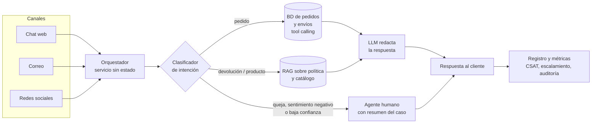

# Fase 1 — Selección y justificación del modelo de IA

## 1. El problema en números

| Dato del caso | Implicación para el diseño |
|---|---|
| **Miles de consultas diarias** | El costo por consulta y la escalabilidad importan más que en un piloto. |
| **80 % repetitivas** (estado del pedido, devoluciones, características del producto) | Son automatizables si el modelo tiene acceso a los datos correctos. |
| **20 % complejas** (quejas, problemas técnicos, sugerencias) | Requieren empatía y criterio humano: el sistema debe saber **cuándo no responder** y escalar. |
| **24 h de tiempo de respuesta promedio** | El objetivo es bajar a segundos en el 80 % repetitivo y liberar a los agentes para el resto. |
| **Tres canales** (chat, correo, redes sociales) | La solución debe ser un servicio central, no una integración por canal. |

## 2. Requisitos derivados del caso

1. **Precisión absoluta en datos transaccionales.** Un estado de pedido o una fecha de entrega incorrecta es peor que no responder: genera reclamos y pérdida de confianza.
2. **Fluidez y tono empático** en las respuestas generales y, sobre todo, en las negativas (por ejemplo, una devolución que no procede).
3. **Datos que cambian cada hora.** El estado de un pedido cambia varias veces entre la compra y la entrega.
4. **Escalamiento a humanos** para quejas, casos ambiguos o clientes molestos.
5. **Privacidad.** Los pedidos contienen nombres, direcciones e historial de compras, protegidos por la Ley 1581 de 2012 (ver Fase 2).
6. **Costo controlado con volumen alto.** Miles de consultas diarias multiplican cualquier diferencia de precio por token.

## 3. Alternativas evaluadas

- **A. LLM de propósito general sin conexión a datos.** Un modelo como GPT-4 responde solo con lo que aprendió en su entrenamiento.
- **B. LLM pequeño afinado (fine-tuning) con datos de la empresa.** Se entrena un modelo abierto con conversaciones históricas, pedidos y políticas de EcoMarket.
- **C. Solución híbrida.** Un LLM de propósito general, **sin fine-tuning inicial**, conectado a los datos de EcoMarket:
  - **Consulta a la base de datos (tool calling)** para pedidos y envíos.
  - **RAG** (recuperación aumentada) sobre la política de devoluciones y el catálogo.
  - Un **clasificador de intención** que enruta cada consulta.
  - **Escalamiento a un agente humano** para quejas y casos de baja confianza.

## 4. Tabla comparativa

| Criterio | A. LLM general sin datos | B. LLM pequeño afinado | C. Híbrido (recomendada) |
|---|---|---|---|
| **Calidad y precisión en pedidos** | **Baja.** No conoce ningún pedido; inventa o se niega (lo demuestra la v1 de la Fase 3). | **Baja-media.** Memoriza el estado de los pedidos del momento del entrenamiento, que queda desactualizado en horas. | **Alta.** Lee el estado real en la base de datos en cada consulta. |
| **Fluidez y empatía** | **Alta.** Los LLM grandes redactan muy bien. | **Media.** Un modelo pequeño es menos fluido, sobre todo en español. | **Alta.** Usa un LLM general capaz y el tono se controla con el prompt. |
| **Costo** | **Medio.** Solo el pago por token. | **Alto al inicio.** Preparación de datos, entrenamiento, GPU para servir y reentrenamientos. | **Medio-bajo.** Pago por token de un modelo de gama media; el contexto recuperado es pequeño. |
| **Escalabilidad** | **Alta.** El proveedor escala. | **Media.** Hay que dimensionar y operar la infraestructura propia. | **Alta.** Servicio sin estado (stateless) y API del proveedor. |
| **Facilidad de integración** | **Alta**, pero no resuelve el problema. | **Baja.** Requiere MLOps, pipeline de entrenamiento y evaluación. | **Media-alta.** Requiere conectores a la BD de pedidos y un índice de documentos, con APIs estándar. |
| **Mantenimiento** | **Bajo.** | **Alto.** Cada cambio de política o catálogo exige reentrenar. | **Bajo.** Cambiar la política es editar un documento; los datos se leen en vivo. |
| **Privacidad** | **Media.** Los datos del cliente viajan en el prompt. | **Baja.** Los datos personales quedan "dentro" del modelo y no se pueden borrar selectivamente. | **Media-alta.** Solo se envía el pedido consultado; se puede minimizar y anonimizar. |
| **Riesgo de alucinación** | **Muy alto.** | **Alto.** Responde con seguridad datos viejos. | **Bajo.** Respuestas ancladas (grounding) en datos reales, más reglas explícitas de "no sé". |

## 5. Por qué no fine-tuning como base

- **El estado de un pedido cambia constantemente.** El fine-tuning enseña patrones estables, no hechos que cambian cada hora. Un modelo afinado el lunes no sabe que el pedido se entregó el martes.
- **Riesgo de privacidad.** Afinar con conversaciones reales introduce direcciones e historiales en los pesos del modelo. Eso dificulta cumplir el derecho de supresión de la Ley 1581 y puede filtrar datos de un cliente a otro.
- **Costo de mantenimiento.** Cada cambio de catálogo o de política obligaría a reentrenar y reevaluar.
- **No es necesario.** Un LLM general con buen prompt y datos recuperados ya logra el tono y la precisión requeridos. La Fase 3 lo demuestra.

**El fine-tuning queda como mejora opcional futura**, solo para ajustar el **tono de marca**, con datos **anonimizados** y nunca como fuente de datos transaccionales.

## 6. Arquitectura propuesta



**Flujo:**
1. El **orquestador** recibe el mensaje de cualquier canal y lo normaliza.
2. El **clasificador de intención**, un LLM con un prompt corto y salida JSON, identifica si es un pedido, una devolución, una queja u otro tema. También extrae el número de seguimiento, el producto y el sentimiento.
3. Según la intención:
   - **Pedido:** se consulta la base de datos de envíos **por número de seguimiento** y se entrega al LLM solo ese registro.
   - **Devolución o producto:** se recuperan los fragmentos relevantes de la política y la ficha del producto.
   - **Queja, sentimiento negativo o baja confianza:** el caso pasa a un agente humano con un resumen generado automáticamente, para que el cliente no tenga que repetir su historia.
4. El **LLM redacta** la respuesta con reglas explícitas: no inventar, pedir el dato que falte y disculparse si hay retraso.
5. Todo queda **registrado** para medir calidad y auditar alucinaciones.

**Sobre la demostración de la Fase 3:** el código implementa este mismo flujo en versión simplificada (clasificar → enrutar → responder). En lugar de consultar una BD o un índice vectorial, se inyectan en el prompt los archivos completos de pedidos, política y catálogo. Con 15 pedidos esto cabe en el contexto. En producción, con miles de pedidos, se reemplaza por la consulta selectiva descrita arriba.

## 7. Estimación de costos

**Fórmula:**

```
Costo mensual = consultas/día × % automatizado × (tokens entrada × precio entrada + tokens salida × precio salida) × 30
```

**Supuestos (explícitos y ajustables):**

| Supuesto | Valor | Justificación |
|---|---|---|
| Consultas por día | 5.000 | El caso dice "miles"; se toma un valor intermedio. [VERIFICAR con el volumen real] |
| % automatizado | 70 % | Menor que el 80 % repetitivo, por prudencia: parte de lo repetitivo se escalará por baja confianza. |
| Tokens de entrada por consulta | 1.800 | Prompt de sistema (~800) + datos recuperados (~500) + mensaje e historial (~200) + clasificador (~300). |
| Tokens de salida por consulta | 250 | Respuesta de hasta 5 oraciones (~200) + JSON del clasificador (~50). |

Con estos supuestos: 5.000 × 0,70 × 30 = **105.000 consultas automatizadas al mes**, que equivalen a **189 M tokens de entrada** y **26,25 M tokens de salida**.

**Escenario 1: modelo comercial vía API** (precios estándar por millón de tokens, consultados el 2026-09-23 en la [página oficial de precios de OpenAI](https://developers.openai.com/api/docs/pricing)):

| Modelo | Entrada (USD/1M) | Salida (USD/1M) | Costo mensual estimado |
|---|---|---|---|
| gpt-4o-mini | 0,15 | 0,60 | 189 × 0,15 + 26,25 × 0,60 = **≈ USD 44** |
| gpt-4.1-mini | 0,40 | 1,60 | 189 × 0,40 + 26,25 × 1,60 = **≈ USD 118** |
| gpt-4o | 2,50 | 10,00 | 189 × 2,50 + 26,25 × 10,00 = **≈ USD 735** |

**Escenario 2: modelo open-source** (por ejemplo, Qwen de Alibaba o Llama de Meta, ambos de pesos abiertos)
- **Vía API de un proveedor de inferencia.** Los modelos abiertos se consumen por token igual que los comerciales, pero a menor precio. Algunos proveedores, como OpenRouter, incluso los ofrecen gratis con límites de uso, que es lo que se usó para la demo; eso no sirve para producción. Como referencia, Llama 3.1 8B en Groq cuesta a USD 0,05 / 0,08 por millón de tokens [VERIFICAR en https://groq.com/pricing; el valor se tomó de fuentes secundarias]: 189 × 0,05 + 26,25 × 0,08 = **≈ USD 12/mes**.
- **Autoalojado en GPU propia o en la nube** (por ejemplo, Qwen servido con vLLM u Ollama). El costo deja de depender de los tokens y pasa a depender de las horas de GPU:
  `Costo mensual ≈ nº de GPU × 730 h × precio por hora de GPU + operación`.
  - Con una GPU de gama media a un precio de USD X/h [VERIFICAR en la página del proveedor de nube elegido], una sola instancia 24/7 cuesta 730·X USD al mes.
  - A eso se suma lo más caro: el **tiempo del equipo** que la opera (monitoreo, actualizaciones y alta disponibilidad con al menos dos instancias).

**Lectura de los números:**
- A este volumen, la API de un modelo de gama media cuesta **del orden de decenas a cientos de dólares al mes**. Es un valor bajo frente al costo de atender manualmente 105.000 consultas.
- El autoalojamiento solo se justifica por **privacidad o soberanía de datos**, o a un volumen mucho mayor, no por ahorro.
- El factor que más mueve el costo es el **tamaño del contexto**. Por eso en producción se recupera solo el pedido consultado, en lugar de inyectar toda la base.

## 8. Escalabilidad e integración

- **Arquitectura sin estado (stateless):** el orquestador no guarda sesión en memoria (el historial va en una caché o BD externa), así que escala horizontalmente agregando instancias detrás de un balanceador.
- **Integración vía API** con el sistema de pedidos existente. El LLM **no accede directamente a la BD**: invoca una función `consultar_pedido(numero)` con permisos de solo lectura, que devuelve únicamente los campos necesarios.
- **Proveedor intercambiable:** usar el estándar de API compatible con OpenAI permite cambiar de modelo (OpenRouter, OpenAI, Groq, un modelo autoalojado con Ollama o vLLM) cambiando solo la configuración. La Fase 3 lo demuestra: el mismo código funciona con todos estos proveedores editando solo `.env`.
- **Despliegue por etapas:**
  1. **Chat web:** es el canal de mayor volumen y donde la respuesta inmediata más se nota.
  2. **Correo:** el asistente propone un borrador y un agente lo aprueba al principio.
  3. **Redes sociales:** canal público, de mayor riesgo reputacional, que se habilita al final y con umbrales de escalamiento más estrictos.

## 9. Modelo para la demostración vs. modelo para producción

- **Demostración (Fase 3):** **Qwen**, la familia de modelos de lenguaje de **pesos abiertos de Alibaba** (licencia [VERIFICAR en la ficha del modelo usado]), consumido gratis vía OpenRouter con temperatura 0. El enunciado permite un modelo open-source en esta fase, y Qwen tiene tres ventajas para el caso:
  - Buen desempeño en español entre los modelos abiertos.
  - Costo cero para la demostración.
  - El **mismo modelo se puede autoalojar** (Ollama o vLLM) si EcoMarket necesita que los datos de sus clientes no salgan de su infraestructura. Es la ruta de soberanía de datos descrita en la Fase 2.

  El código funciona sin cambios con Qwen local (`qwen2.5:7b` en Ollama), con Llama en Groq o con modelos comerciales como `gpt-4o-mini`.
- **Producción:** se recomienda un modelo de **gama media**, comercial (por ejemplo, `gpt-4o-mini` o `gpt-4.1-mini`) o abierto de mayor tamaño (por ejemplo, un Qwen de más parámetros autoalojado o por API de pago). Los endpoints gratuitos no sirven para producción: tienen límites de uso, no ofrecen garantías de disponibilidad y pueden guardar los prompts. Se aplica una estrategia por tareas:
  - El **clasificador**, una tarea corta y estructurada, puede usar el modelo más barato.
  - La **redacción de respuestas**, que necesita más fluidez y empatía, usa el modelo de gama media.
  - Un modelo de gama alta (tipo `gpt-4o`) cuesta unas **16 veces más** en este escenario, sin una ganancia clara para respuestas cortas y ancladas en datos.

  Como advierte el tutorial de clase de Real Python, **cambiar a un modelo más grande no garantiza mejores resultados y sí aumenta el costo por token**: la calidad en este caso viene sobre todo del **acceso a datos correctos y del diseño del prompt**.

## 10. Conclusión

Se elige una **solución híbrida**:
- Un **LLM de propósito general** de gama media, **sin fine-tuning**.
- **Consulta a la base de datos** para la precisión en pedidos y **RAG** para la política y el catálogo.
- Un **clasificador de intención** que escala a humanos lo que requiere empatía.

La decisión responde a los cuatro criterios del taller:
- **Calidad:** respuestas ancladas en datos vivos, en lugar de memorizados o inventados.
- **Costo:** decenas a cientos de USD al mes para 105.000 consultas.
- **Escalabilidad:** servicio sin estado sobre una API gestionada.
- **Integración:** conectores estándar y un proveedor intercambiable.
